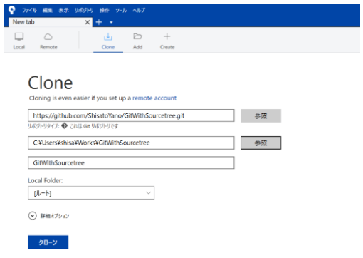
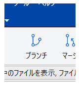

# Gitによる複数人でのバージョン管理をSourceTreeを使って体験してみる
---
<!-- TOC -->

- [Gitによる複数人でのバージョン管理をSourceTreeを使って体験してみる](#gitによる複数人でのバージョン管理をsourcetreeを使って体験してみる)
    - [はじめに](#はじめに)
    - [前提条件](#前提条件)
    - [作業対象とするGitHubリポジトリ](#作業対象とするgithubリポジトリ)
    - [SourceTreeについて](#sourcetreeについて)
    - [今回のシナリオ](#今回のシナリオ)
    - [Step1: リモートリポジトリをローカルにクローンする](#step1-リモートリポジトリをローカルにクローンする)
    - [Step2: 3人それぞれのブランチをmasterから作成して作業開始](#step2-3人それぞれのブランチをmasterから作成して作業開始)
    - [Bの作業が先に完了→プルリクを作成してマージ](#bの作業が先に完了→プルリクを作成してマージ)
    - [Step4: Shisatoの作業ブランチにBの完了分をマージして作業継続→完了したらプルリクを作成してマージ](#step4-shisatoの作業ブランチにbの完了分をマージして作業継続→完了したらプルリクを作成してマージ)
    - [Step5: Aの作業ブランチにShisatoとBの完了分をマージして作業継続→完了したらプルリクを作成してマージ](#step5-aの作業ブランチにshisatoとbの完了分をマージして作業継続→完了したらプルリクを作成してマージ)
    - [参考資料](#参考資料)

<!-- /TOC -->

## はじめに
---
今の職場におけるバージョン管理システムをSVNからGitに変更することを提案したいと考えており、それの参考にと思い下記の書籍を読みました。  

[いちばんやさしいGit&GitHubの教本](https://www.amazon.co.jp/%E3%81%84%E3%81%A1%E3%81%B0%E3%82%93%E3%82%84%E3%81%95%E3%81%97%E3%81%84Git-GitHub%E3%81%AE%E6%95%99%E6%9C%AC-%E4%BA%BA%E6%B0%97%E8%AC%9B%E5%B8%AB%E3%81%8C%E6%95%99%E3%81%88%E3%82%8B%E3%83%90%E3%83%BC%E3%82%B8%E3%83%A7%E3%83%B3%E7%AE%A1%E7%90%86-%E5%85%B1%E6%9C%89%E5%85%A5%E9%96%80-%E3%80%8C%E3%81%84%E3%81%A1%E3%81%B0%E3%82%93%E3%82%84%E3%81%95%E3%81%97%E3%81%84%E6%95%99%E6%9C%AC%E3%80%8D%E3%82%B7%E3%83%AA%E3%83%BC%E3%82%BA/dp/429500524X/ref=sr_1_3?ie=UTF8&qid=1546691781&sr=8-3&keywords=Git)

インストールや初期設定の手順から、実際にブランチを切りながらバージョン管理していく流れまで述べられていて大変参考になりました。ただし、これらは全てGit bashからのコマンド操作によるものがメインであり、今後職場で導入提案をするならGUIツールを使った場合の操作手順を把握しておきたいと考えました。  
今回の記事では、GitのGUIツールとして人気の高いSourceTreeを使いながら、Gitでの複数人バージョン管理を一人で自作自演しながら体験してみた流れを紹介していきます。  

## 前提条件
---
- Gitのインストール及び初期設定が既に完了している
- OS: Windows 10 Home 64bit
- リモートリポジトリはGitHub上に作成

## 作業対象とするGitHubリポジトリ
---
今回は下記のリモートリポジトリをクローンして作業します。  
[リモートリポジトリのURL](https://github.com/ShisatoYano/GitWithSourcetree)

## SourceTreeについて
---
SourceTreeのインストール手順や基本的な使い方については、下記の記事に分かりやすく書かれているので参照ください。  
[Gitなんて怖くない！超初心者向け、SourceTreeの使い方はじめの一歩](https://prog-8.com/blogs/how_to_use_sourcetree)

## 今回のシナリオ
---
- 作業者: Shisato(自分)、作業者A、作業者Bの３名
- 全体の作業内容: 上記リポジトリのREADME.mdのファイルに、本記事と同じ内容の文章を書く。
- Shisatoの作業ブランチ: タイトルから導入部分まで
- Aの作業ブランチ: メイン内容の部分
- Bの作業ブランチ: 参考資料の部分
- Step1: リモートリポジトリをローカルにクローンする
- Step2: ３人それぞれのブランチをmasterから作成して作業開始
- Step3: Bの作業が先に完了→プルリクを作成してマージ
- Step4: Shisatoの作業ブランチにBの完了分をマージして作業継続→完了したらプルリクを作成してマージ
- Step5: Aの作業ブランチにShisatoとBの完了分をマージして作業継続→完了したらプルリクを作成してマージ
- Step6: 追加作業でブランチ作成してマージしようとしたらコンフリクト→コンフリクトを解消してマージ

## Step1: リモートリポジトリをローカルにクローンする
---
まずは、リモートリポジトリをローカルリポジトリにクローンするためのフォルダを作成します。今回は、GitWithSourcetreeという名前のフォルダを作りました。  

そして次に、SourceTreeを開いてリモートリポジトリをクローンします。新しいタブを開いて上のメニューから「Clone」を選ぶと、下記の画面のようにクローンの操作を行う画面に遷移します。続いて、上から順にリモートリポジトリのURL、既に作成したクローン先のローカルフォルダ、ブックマーク名を入力します。  

最後に、画面したの青ボタン「クローン」をクリックすると、先ほど設定したローカルフォルダにリモートリポジトリの中身がクローンされ、SourceTree上ではそのリポジトリのバージョン管理を可視化する画面に遷移します。  

## Step2: 3人それぞれのブランチをmasterから作成して作業開始
---
現時点のSourceTreeの画面の左上メニューから「ブランチ」を選択します。  

選択すると下記のようにブランチ作成画面に移ります。

ここで入力する各項目の意味は下記の表の通りです。  
ここでは、まず３人分の作業ブランチを作ってしまうので、新規ブランチ作成後のチェックアウトの項目のチェックは外しておきます。  

最後に「ブランチを作成」ボタンをクリックすると、親のmasterブランチを起点にしたトピックブランチが作成されます。ここまでの操作を繰り返して、下記の3つの作業ブランチを作成します。  

- Shisatoの作業ブランチ: Introduction_Shisato
- Aの作業ブランチ: Main_A
- Bの作業ブランチ: Reference_B

作成後のSourceTreeの画面は下記のようになり、ベースとなるmasterブランチと同じ状態で上記の3つのブランチが作成されていることが分かります。  

## Bの作業が先に完了→プルリクを作成してマージ
---
ここからは分担した作業ごとにブランチを切り替えながら進めていきます。SourceTree上でブランチを切り替える際は、下記の画面で切り替えたいブランチ名をダブルクリックすることで切り替わります。  

最初はmasterブランチになっているので、上記の画面ではmasterの横に印が付いています。ここではまず、一番作業量が少ないBが先に作業を終えてマージするというシナリオなので、作業ブランチをmasterからReference_Bブランチに切り替えます。上記の画面でReference_Bの名前をダブルクリックすると、作業ブランチがReference_Bブランチに切り替わり、下記の画面のようになります。  

作業対象ファイルであるREADME.mdは、クローン直後では下記のような状態であり、タイトルと概要のみが書かれています。これに、Bの担当分である参考資料のパートを追加します。  

追加した後のファイルは下記のようになります。

ファイルの編集が終わったところで、SourceTreeの画面に戻ってみましょう。すると、下記のように画面が更新され、コミットされていない変更があるということが示されています。  

まずは、編集したファイルをステージに追加しましょう。画面左下の「作業ツリーのファイル」から対象ファイルを選択して右クリックし、メニューから「追加」を選びます。すると、下記画面のようにコミット対象としてステージに追加された状態に遷移します。今度は、「Indexにステージしたファイル」のグループに移動していることが分かります。  

そして今度は、左上のメニューから「コミット」を選択します。  

すると下記の画面に遷移するので、画面下のコメント欄にコメントを記入して、右下の「コミット」ボタンを押します。これでコミットは完了です。  

そして今度は、このコミット内容をリモート側に反映させるためにプッシュを行います。コミット後の画面左のブランチ一覧から現在作業中のReference_Bブランチを右クリックします。  

右クリック後に開いたメニューから「プッシュ先」を選択し、そこで表示されるものの中から「origin」を選択します。すると、下記のようにプッシュ操作を行う画面が開きます。  

ここで、プッシュ先のリポジトリがorigin、対象のローカルブランチとリモートブランチがReference_Bとなっていて、かつチェックが付いていることを確認し、問題がなければ右下の「プッシュ」ボタンを押します。それによって、リモートのoriginリポジトリのReference_BブランチとローカルのReference_Bブランチが同期され、SourceTree上では下記のような状態になります。  

さて、ここまで来てようやくマージ作業に移れます。GitHub上のリモートリポジトリをブラウザで開くと下記画面のようになるので、ここからプルリクエストを作成しましょう。  

今回は作業者は3人ですが、Gitのアカウントは自分一人だけなのでReviewerの設定などは行わず、そのままプルリクエストを作成します。  

完全に自作自演ですが、一応変更内容をレビューして問題がないことをコメントしてからマージします。  

マージ後に、GitHub上でCommits履歴が下記のようになっていれば無事にマージは完了です。  

## Step4: Shisatoの作業ブランチにBの完了分をマージして作業継続→完了したらプルリクを作成してマージ
---
ここからは、作業ブランチをShisato担当分のIntroduction_Shisatoブランチに切り替えて進めます。ただその前に、まずはBによってリモートにマージされた分をローカルに反映しておきましょう。SourceTreeでブランチをmasterに切り替えると、プルで反映するべき変更が示されるようになります。  

左側のブランチからmasterを右クリックし、メニューから「origin/masterをプル」を選択するとプル操作を行う画面が開きます。プル元のリポジトリがorigin、ブランチがmaster、プル先のローカルブランチがmasterであることを確認したら「OK」を押します。すると、リモート側の変更がローカルのmasterブランチに反映されます。  

次に、これから作業するIntroduction_Shisatoブランチに切り替えて、masterに取り込んだ変更をマージします。ブランチを切り替え、画面上のメニューから「マージ」を選択すると、現在のブランチにマージするコミットを選択する画面が開きます。  

ここでコミットをmasterブランチにおける最新のものにして「OK」とすれば、そのコミットがIntroduction_Shisatoブランチにマージされて、下記のようにmasterブランチと肩を並べた状態になります。  

ここから、Shisatoの担当分であるメイン内容手前までの部分を追加して、前述した通りの手順でコミット、マージを行いこのステップは完了です。  
マージして、ローカルのmasterブランチに反映させた状態は下記の通りになります。  

## Step5: Aの作業ブランチにShisatoとBの完了分をマージして作業継続→完了したらプルリクを作成してマージ
---
Step4までの間でShisatoとBがコミット、マージした分を、まずはMain_Aブランチにマージします。チェックアウトで作業ブランチをMain_Aブランチに切り替えて、それにmasterブランチへの最新コミットをマージします。  

## 参考資料
---
- [まずはGitの仕組みを理解することから](https://qiita.com/kyoyyy/items/161b6905f45bee2efe21)
- [ブランチ操作 - SourceTree](https://qiita.com/inabe49/items/be38f569040aed7d85b0)
- [Git概念の整理を試みる](https://open-groove.net/git/git-summary/)
- [たまご工房ブログ](http://tamagokobo.blogspot.com/2015/07/blog-post_21.html)
